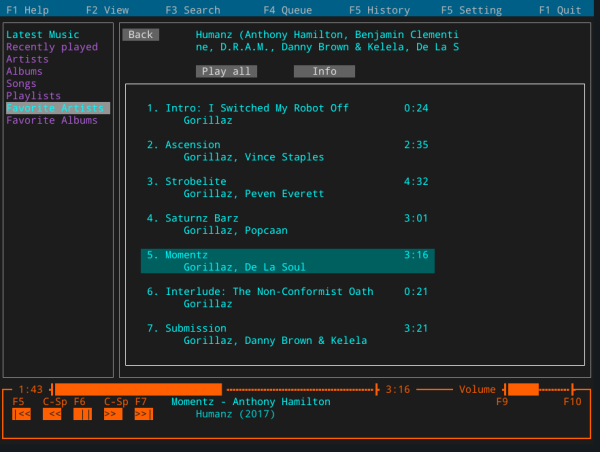

# Jellycli

[](https://pkg.go.dev/tryffel.net/go/jellycli)
[](https://goreportcard.com/report/tryffel.net/go/jellycli)

Terminal music player for Jellyfin.



## Features
* View artists, songs, albums, playlists, favorite artists and albums, genres, similar albums and artists
* Queue: add songs and albums, reorder & delete songs, clear queue
* Control (and view) play state through Dbus integration
* Remote control over Jellyfin server. Currently implemented:
    * Play / pause / stop
    * Set volume
    * Next/previous track
    * Control queue
* Supported formats (server transcodes everything else to mp3): mp3,ogg,flac,wav
* headless mode (--no-gui)

**Platforms tested**:
* [x] Windows 10 
* [x] Linux 64 bit
* [ ] Linux 32 bit (raspi 2)
* [ ] MacOS


## Building
**You will need Go 1.13 or Go 1.14 installed and configured**

* For additional audio libraries required, see [Hajimehoshi/oto](https://github.com/hajimehoshi/oto). 
On linux you need libasound2-dev.
* Currently jellycli has issues with Windows and is unable to start properly.

**Warning: for the time being, use git clone directly instead of go get.** There is an issue with dependency 
(rivo/tview) being automatically upgraded and causing deadlocks.

Download & build package
```
git clone https://github.com/tryffel/jellycli.git
cd jellycli
# checkout tag:
# git checkout vx.x.x
go build .
./jellycli
```

## Run
``` 
# Gui
./jellycli

# Headless mode
./jellycli --no-gui
```

## Docker
Jellycli has experimental docker image tryffel/jellycli. Do note that you might run into issues using audio with docker.
Jellycli relies on alsa and might clash with pulseaudio. In case of problems, 
ensure you have alsa installed on host machine and disable / kill pulseaudio if required. 

```
mkdir ~/jellycli-config
# Gui
docker run -it --rm --device /dev/snd:/dev/snd  -v ~/jellycli-config/jellycli-conf:/root/.config jellycli

# Headless mode
docker run -it --rm --device /dev/snd:/dev/snd  -v ~/jellycli-config/jellycli-conf:/root/.config jellycli --no-gui
```

On first time application asks for Jellyfin host, username, password and default collection for music. 
All this is stored in configuration file:
* ~/.config/jellycli/jellycli.yaml 
* C:\Users\<user>\AppData\Roaming/jellycli/jellycli.yaml

Configuration file location is also visible in help page. 
You can use multiple config files by providing argument:
```
jellycli --config temp.yaml
```

Log file is located at '/tmp/jellycli.log' or 'C:\Users\<user>\AppData\Local\Temp/jellycli.log' by default. 
This can be overridden with config file. 
At the moment jellycli does not inform user about errors but rather just silently logs them.
For development purposes you should set log-level either to debug or trace.

## Acknowledgements
Thanks [natsukagami](https://github.com/natsukagami/mpd-mpris) for implementing Mpris-interface.
